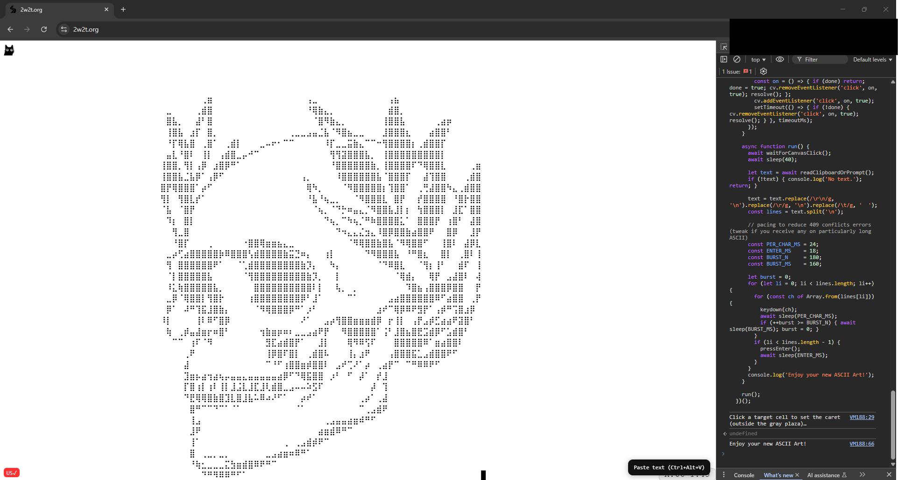

#  <p align="center"> ASCII Scripting Tool for 2w2t! </p>

<p align="center"> Automatically paste your art line by line into 2w2t directly from your clipboard using only the browser console - no extensions required.</p>

<p align="center">
  
</p>

## How to use

1. Open [www.2w2t.org](https://2w2t.org/)

2. Press F12 → Console.

3. Paste this script → Enter.

4. Click the start cell (outside the gray plaza).

5. It will being pasting your ASCII Art line by line starting from the top. Enjoy!

   <p align="center">
  
</p>

   ```js
   (() => {
    const sleep = ms => new Promise(r => setTimeout(r, ms));
  
    async function readClipboardOrPrompt() {
      try {
        const t = await navigator.clipboard.readText();
        if (t && t.trim()) return t;
      } catch {}
      return prompt('Paste your text here:') || '';
    }
  
    function keydown(key) {
      const ev = new KeyboardEvent('keydown', {
        key,
        code: /^[a-z]$/i.test(key) ? `Key${key.toUpperCase()}` :
              key === ' ' ? 'Space' :
              key === 'Enter' ? 'Enter' : 'Unidentified',
        bubbles: true,
        cancelable: true
      });
      window.dispatchEvent(ev);
    }
  
    function pressEnter() { keydown('Enter'); }
  
    function waitForCanvasClick(timeoutMs = 10000) {
      const cv = document.querySelector('canvas');
      if (!cv) return Promise.resolve();
      console.log('Click a target cell to set the caret (outside the gray plaza)…');
      return new Promise(resolve => {
        let done = false;
        const on = () => { if (done) return; done = true; cv.removeEventListener('click', on, true); resolve(); };
        cv.addEventListener('click', on, true);
        setTimeout(() => { if (!done) { cv.removeEventListener('click', on, true); resolve(); } }, timeoutMs);
      });
    }
  
    async function run() {
      await waitForCanvasClick();
      await sleep(40); 
  
      let text = await readClipboardOrPrompt();
      if (!text) { console.log('No text.'); return; }
  
      text = text.replace(/\r\n/g, '\n').replace(/\r/g, '\n').replace(/\t/g, '  ');
      const lines = text.split('\n');
  
      // pacing to reduce 409 conflicts errors (tweak if you receive any on particularly long ASCII)
      const PER_CHAR_MS = 24;
      const ENTER_MS    = 18;
      const BURST_N     = 180; 
      const BURST_MS    = 160;
  
      let burst = 0;
      for (let li = 0; li < lines.length; li++) {
        for (const ch of Array.from(lines[li])) { 
          keydown(ch);
          await sleep(PER_CHAR_MS);
          if (++burst >= BURST_N) { await sleep(BURST_MS); burst = 0; }
        }
        if (li < lines.length - 1) {
          pressEnter();
          await sleep(ENTER_MS);
        }
      }
      console.log('Enjoy your new ASCII Art!');
    }
  
    run();
   })();

  
